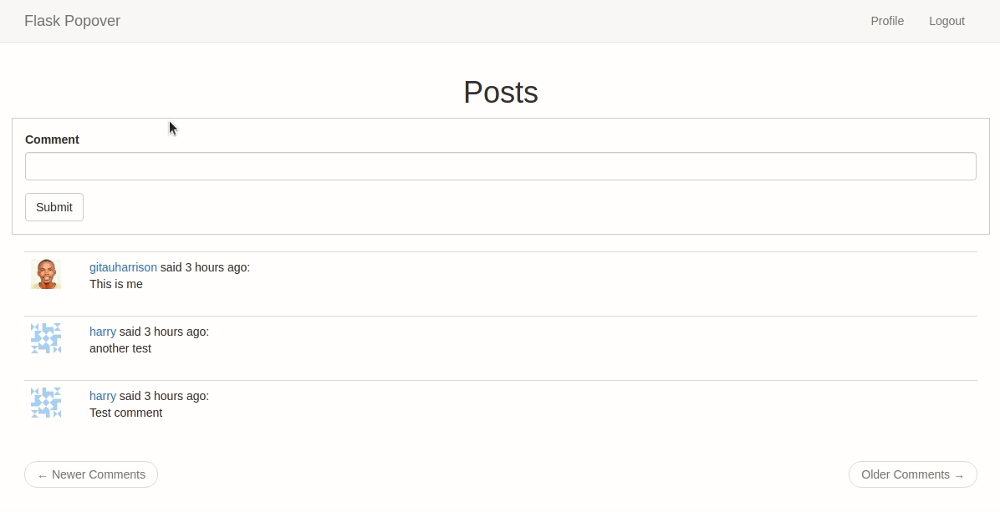

# Add Popovers to Links in Flask App

It is a fairly common feature in web applications to have links that open a popover when hovered. Twitter does this, Facebook does it, LinkedIn does it. Popovers are a great way to provide additional information to users.



## Features

- User Registration and authentication
- Profile popovers

## Tools Used

- Flask framework
- Python for programming
- Flask-Bootstrap
- Flask-WTF
- Flask-SQLAlchemy
- Flask-Login
- Flask-Migrate
- Flask-Moment
- Email validator
- Python-dotenv
- Ajax requests

## Contributors

[](https://github.com/GitauHarrison/flask-popovers/graphs/contributors)

## Testing the Deployed Application

* [Application on Heroku](https://flask-popover.herokuapp.com/login?next=%2Findex)

You can use the following credentials to test the deployed application:
* Username: harry
* Password: 12345678

Alternatively, you can create your own user by clicking the [Register](https://flask-popover.herokuapp.com/register) link. You will be redirected to the [Login page](https://flask-popover.herokuapp.com/login) automatically where you can authenticate that user.

## Testing the Application Locally

1. Clone this repository:

    ```python
    $ git clone git@github.com:GitauHarrison/flask-popovers.git
    ```
<br>

2. Change into the directory:

    ```python
    $ cd flask-popovers
    ```
<br>

3. Create and activate a virtual environment:

    ```python
    $ virtualenv venv
    $ source venv/bin/activate

    # Alternatively, you can use virtualenvwrapper
    $ mkvirtualenv venv
    ```

    * Virtualenvwrapper is a wrapper around virtualenv that makes it easier to use virtualenvs. `mkvirtualenv` not only creates but also activates a virtual enviroment for you. Learn more about virtualenvwrapper [here](https://github.com/GitauHarrison/notes/blob/master/virtualenvwrapper_setup.md).
<br>

4. Install dependencies:
    
    ```python
    (venv)$ pip install -r requirements.txt
    ```
<br>

5. Add environment variables as seen in the `.env-template`:
    
    ```python
    (venv)$ cp .env-template .env
    ```

    * You can get a random value for your `SECRET_KEY` by running `python -c "import os; print os.urandom(24)"` in your terminal.
<br>

5. Run the application:

    ```python
    (venv)$ flask run
    ```
<br>

6. Open the application in your favourte browser by copying and pasting the link below:
   * http://localhost:5000
<br>

7. Feel free to create a new user and see the popovers in action. You can do so by [registering a user](http://127.0.0.1:5000/register) then [logging in](http://127.0.0.1:5000/login).


## How To

### Select Element

To create a popover on a link, you first need to identify what link exactly you want to have a popover. You can do this by adding the `class` selector on an `<a>` element. For example, if you want to add a popover to the link `/user/<username>`, you would add the following to the `<a>` element:

```html
<span class="user_popup">
    <a href="{{ url_for('user', username=post.author.username) }}">
        {{ post.author.username }}
    </a>
</span>
```

In the example above, I have modified how I select the link I want to have a popover. This is deliberate. Typically, I would have done:

```html
<a class="user_popup" href="{{ url_for('user', username=post.author.username) }}">
        {{ post.author.username }}
</a>
```

But this has the ugly effect where the popover will acquire the behaviour of the `<a>` parent element. This is not desirable. I will end up with something that looks like this:

```html
<a href="" class="user_popup">
    <a href="{{ url_for('user', username=post.author.username) }}">
        {{ post.author.username }}

        <div> <!-- popover element goes here --> </div>
    </a>
</a>
```

Typically, making the popover a child of the hovered element works perfectly for buttons and generally `<div>` and `<span>`.

### Hover Event

Using JQuery, a hover event can be attached to any HTML element by calling the `element.hover(handlerIn, handlerOut)` method. JQuery can also conviniently attach the events if the functions are called on a collection of elements.

```js
$('.user_popup').hover(
    function(){
        // Mouse in event handler
        var elem = $(event.currentTarget);
    },
    function(){
        // Mouse out event handler
        var elem = $(event.currentTarget);
    }
)
```

### Ajax Request

When using JQuery, `$.ajax()` function is used to send an asynchronous request to the server. An example of a request can be `/user/<username>/popup`. This request contains HTML that will be inserted  into the popover.

```js
$(function() {
        var timer = null;
        var xhr = null;
        $('.user_popup').hover(
            function(event) {
                // mouse in event handler
                var elem = $(event.currentTarget);
                timer = setTimeout(function() {
                    timer = null;
                    xhr = $.ajax(
                        '/user/' + elem.first().text().trim() + '/popup').done(
                            function(data) {
                                xhr = null
                                // create and display popup here
                            }
                        );
                }, 500);
            },
            function(event) {
                // mouse out event handler
                var elem = $(event.currentTarget);
                if (timer) {
                    clearTimeout(timer);
                    timer = null;
                }
                else if (xhr) {
                    xhr.abort();
                    xhr = null;
                }
                else {
                    // destroy popup here
                }
            }
        )
    });
```

The `$.ajax()` call returns a promise, which essentially is a special JS object that represents asynchronous operation.

### Create Popover

`data` argument passed by the `$.ajax()` call is the HTML that will be inserted into the popover.

```js
function(data) {
    xhr = null;
    elem.popover({
        trigger: 'manual',
        html: true,
        animation: false,
        container: elem,
        content: data
    }).popover('show');
    flask_moment_render_all();
}
```
The return of the `popover()` call is the newly created popover component. `flask_moment_render_all()` function is used to display the last time a user was active.

### Destroy Popover

If the user hovers away from the popover, the popover will be aborted. This is done by calling the `.popover('destroy')` method.

```js
function(event) {
    // mouse out event handler
    var elem = $(event.currentTarget);
    if (timer) {
        clearTimeout(timer);
        timer = null;
    }
    else if (xhr) {
        xhr.abort();
        xhr = null;
    }
    else {
        elem.popover('destroy');
    }
}
```

## Reference

* If you would like to see how the application above has been built from scratch, you can look at this [flask popover](https://github.com/GitauHarrison/notes/blob/master/flask_popover.md) tutorial.
* If you prefer to only see how this feature can be implemented, look at this [flask popover section](https://github.com/GitauHarrison/notes/blob/master/flask_popover/popover.md)

## Going Further

If you would like to add private messaging and user notifications to your flask application, you can look at the [user notifications in flask](https://github.com/GitauHarrison/user-notifications-in-flask) repository to learn more.